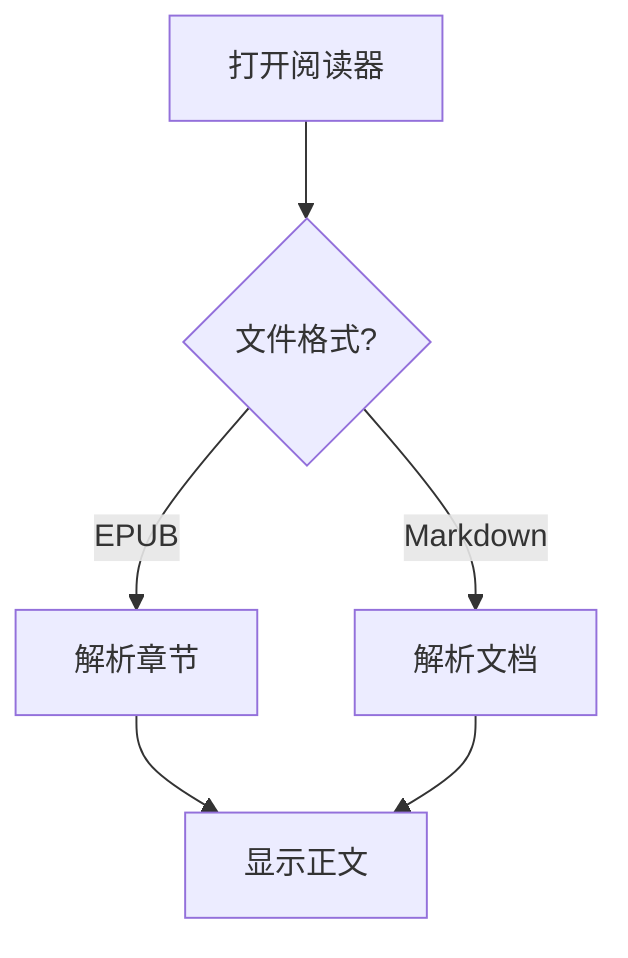

# 流程图渲染测试

## 基础流程图

下面的 Mermaid 代码块应显示为流程图，而不是代码文本。


```mermaid
flowchart TD
    A[打开阅读器] --> B{文件格式?}
    B -->|EPUB| C[解析章节]
    B -->|Markdown| D[解析文档]
    C --> E[显示正文]
    D --> E
```

## 横向流程图与普通代码


```mermaid
flowchart LR
    开始 --> 阅读 --> 保存进度 --> 结束
```

下面的普通代码块应继续显示为代码。

```text
flowchart TD
    A --> B
```
